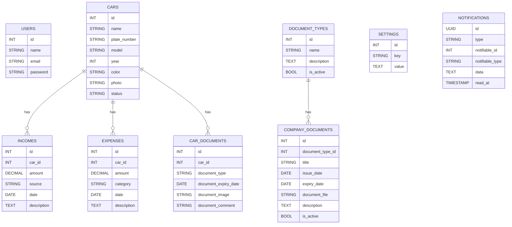

# Car Expense Tracker Database ER Diagram

```mermaid
erDiagram
    USERS {
        INT id
        STRING name
        STRING email
        STRING password
    }
    CARS {
        INT id
        STRING name
        STRING plate_number
        STRING model
        INT year
        STRING color
        STRING photo
        STRING status
    }
    INCOMES {
        INT id
        INT car_id
        DECIMAL amount
        STRING source
        DATE date
        TEXT description
    }
    EXPENSES {
        INT id
        INT car_id
        DECIMAL amount
        STRING category
        DATE date
        TEXT description
    }
    CAR_DOCUMENTS {
        INT id
        INT car_id
        STRING document_type
        DATE document_expiry_date
        STRING document_image
        STRING document_comment
    }
    DOCUMENT_TYPES {
        INT id
        STRING name
        TEXT description
        BOOL is_active
    }
    COMPANY_DOCUMENTS {
        INT id
        INT document_type_id
        STRING title
        DATE issue_date
        DATE expiry_date
        STRING document_file
        TEXT description
        BOOL is_active
    }
    SETTINGS {
        INT id
        STRING key
        TEXT value
    }
    NOTIFICATIONS {
        UUID id
        STRING type
        INT notifiable_id
        STRING notifiable_type
        TEXT data
        TIMESTAMP read_at
    }

    CARS ||--o{ INCOMES : has
    CARS ||--o{ EXPENSES : has
    CARS ||--o{ CAR_DOCUMENTS : has
    DOCUMENT_TYPES ||--o{ COMPANY_DOCUMENTS : has
```

---

- Each car can have many incomes, expenses, and documents.
- Each document type can have many company documents. 